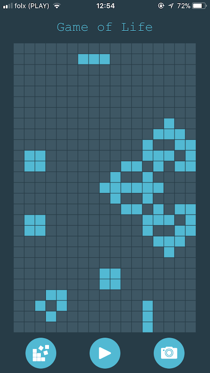
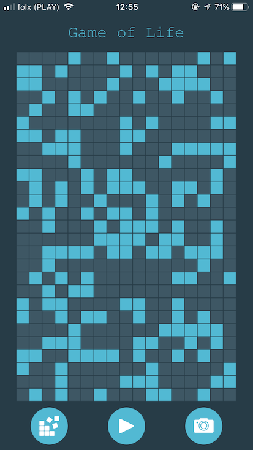

An implementation of Conway's Game of Life for iOS created for academic purposes. The application allows you to:
+ Populate the game table with random alive cell structure
+ Revival of any selected cell
+ Play/pause simulation
+ Making a screenshot of the game board

## Game of Life

The Game of Life was invented by British mathematician John Conway in the 1970 and become an instant hit among microcomputer owners.
The game itself is very simple, the world is modelled as an n x n grid where cells can either be alive or dead.
Each generation, or turn, in the game the following rules are applied:

+ Any dead cell with exactly three neighbours becomes alive
+ Any live cell with more than 3 or less than 2 neighbours dies, due to overcrowding or loneliness respectively.

## Build and Runtime Requirements
+ Xcode 9.0 or later
+ iOS 9.0 or later
+ macOS v10.10 or later

## Installation

### Setup Cocoapods repository

1. Run `pod install` to correctly setup the Cocoapods dependencies
2. Make sure that you open the project referring to  `*.xcworkspace` in Xcode or AppCode

## Screenshots

## Built With

* [SwifterSwift](https://github.com/SwifterSwift/SwifterSwift)
